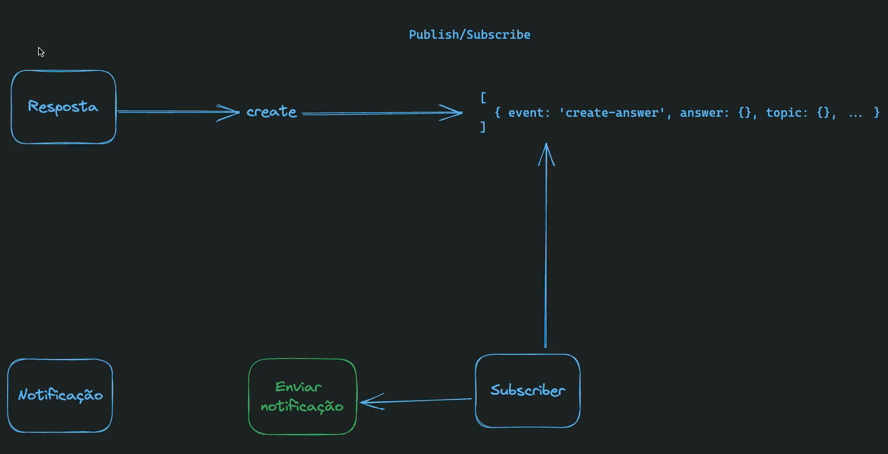
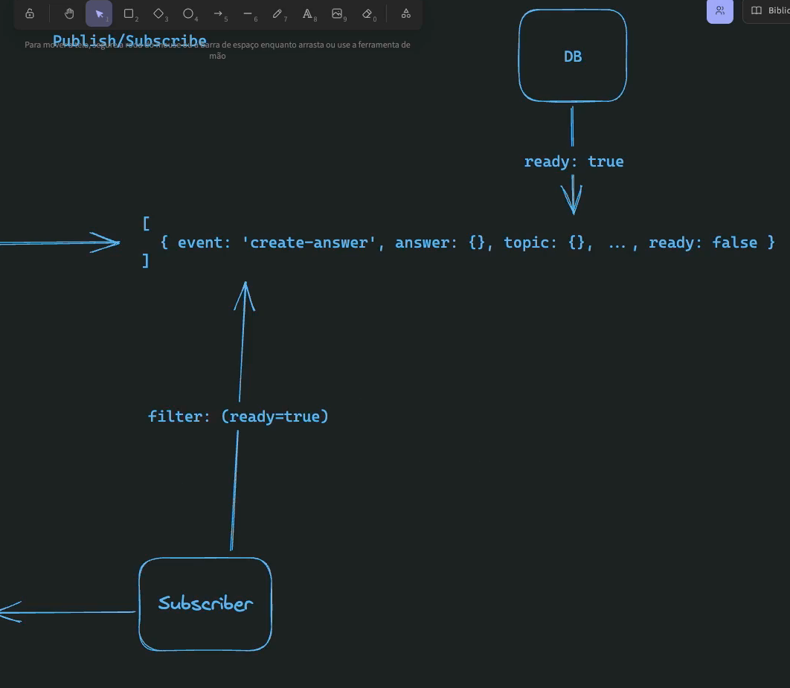

# DDD (Domain-driven Design)

Design dirigido à domínio

- Domain Experts
  - Conversa
- Linguagem ubíqua

- Usuário
  - Cliente
  - Fornecedor
  - Atendente
  - Barman

- Agragados
- Value Objects
- Eventos de domínio
- Subdomínios (Bounded Contexts)
- Entidades
- Casos de Uso

# Subdomínios

- Core
- Supporting
- Generic

## Exemplos

### Core
- Compra
- Catálogo
- Pagamento
- Entrega

### Supporting
- Estoque

### Generic
- Notificação ao cliente
- Promoções
- Chat

